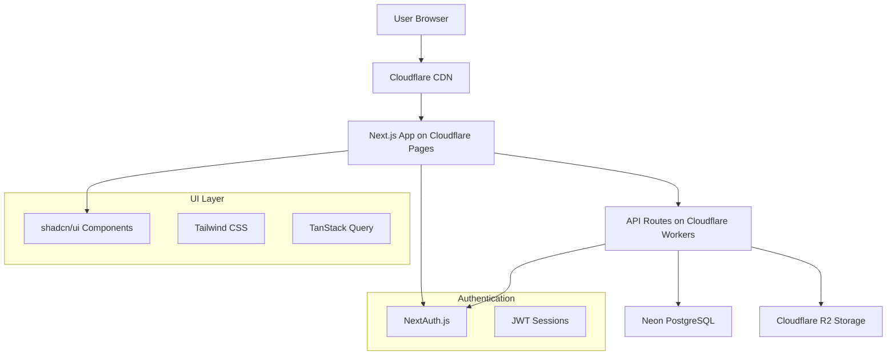

# Design Document

## Overview

The CNKTYKLT Compliance Management Platform is a Next.js-based web application that provides healthcare practitioners and administrators with a centralized system for tracking continuing education compliance. The platform follows a modern serverless architecture using Cloudflare Pages/Workers for hosting and Neon PostgreSQL for data persistence.

### Key Design Principles

- **MVP-First Approach**: Focus on core functionality with minimal complexity
- **Role-Based Access**: Clear separation of concerns between DoH, Unit, and Practitioner roles  
- **Serverless Architecture**: Leverage Cloudflare Workers and Neon for scalability and cost efficiency
- **Security by Design**: Implement proper authentication, authorization, and audit logging
- **Mobile-Responsive**: Ensure usability across devices with progressive enhancement

## Architecture

### High-Level Architecture



### Technology Stack

- **Frontend**: Next.js 15 with App Router, React 19, TypeScript
- **UI Framework**: shadcn/ui components enhanced with glasscn-ui for glassmorphism effects
- **Styling**: Tailwind CSS with custom glassmorphism preset and design tokens
- **Authentication**: NextAuth.js with JWT sessions and bcrypt password hashing
- **Database**: Neon PostgreSQL (serverless) with existing schema
- **File Storage**: Cloudflare R2 for evidence file uploads
- **Hosting**: Cloudflare Pages + Workers or Vercel
- **State Management**: TanStack Query v5 for server state
- **Validation**: Zod for runtime type validation
- **Design System**: Modern glassmorphism with healthcare-focused color palette

## UI/UX Design System

### Glassmorphism Design Language

The platform will implement a modern glassmorphism design system that conveys professionalism and trust while maintaining excellent usability for healthcare professionals.

#### Visual Design Principles
- **Glassmorphism Effects**: Frosted glass cards with subtle blur and transparency
- **Healthcare Color Palette**: 
  - Primary: Medical blue (#0066CC) with glass variants
  - Secondary: Clean green (#00A86B) for success states
  - Warning: Amber (#F59E0B) for alerts
  - Danger: Medical red (#DC2626) for critical alerts
  - Neutral: Cool grays with glass transparency
- **Typography**: Clean, readable fonts optimized for data-heavy interfaces
- **Spacing**: Generous whitespace with consistent 8px grid system
- **Shadows & Depth**: Subtle drop shadows and glass reflections for hierarchy

#### Component Design Patterns
- **Glass Cards**: Semi-transparent backgrounds with backdrop blur
- **Floating Action Buttons**: Glass morphism with subtle hover animations
- **Data Tables**: Clean, scannable layouts with glass row separators
- **Navigation**: Glass sidebar with smooth transitions
- **Modals**: Frosted glass overlays with smooth backdrop blur
- **Progress Indicators**: Glass-style progress bars with gradient fills

#### Responsive Design
- **Mobile-First**: Progressive enhancement from mobile to desktop
- **Breakpoints**: Standard Tailwind breakpoints (sm: 640px, md: 768px, lg: 1024px, xl: 1280px)
- **Touch Targets**: Minimum 44px touch targets for mobile interactions
- **Adaptive Layouts**: Sidebar collapses to drawer on mobile

#### Accessibility Features
- **WCAG 2.1 AA Compliance**: Proper contrast ratios despite glass effects
- **Keyboard Navigation**: Full keyboard accessibility with focus indicators
- **Screen Reader Support**: Semantic HTML and ARIA labels
- **Reduced Motion**: Respect user preferences for reduced motion

### Adaptive Dashboard System

The platform implements role-specific adaptive dashboards that automatically adjust content, functionality, and data scope based on user permissions and organizational hierarchy.

#### Practitioner Dashboard (NguoiHanhNghe Role)
**Layout**: Single-column mobile-first design with personal focus

**Core Components**:
- **Personal Progress Hero Card**
  - Large circular progress indicator showing current cycle completion (0-120 credits)
  - Days remaining in current 5-year cycle with countdown
  - Current compliance status with color-coded indicators (green: >90%, yellow: 70-90%, red: <70%)
  - Quick stats: Total activities submitted, approved credits, pending approvals

- **Activity Management Section**
  - **Submit New Activity**: Prominent glass CTA button with quick-add functionality
  - **Recent Activities Timeline**: Last 10 activities with status badges and approval dates
  - **Draft Activities**: Saved but unsubmitted activities with continue/delete options
  - **Evidence Library**: Quick access to uploaded files with preview capabilities

- **Alerts & Notifications Panel**
  - **Priority Alerts**: Critical compliance warnings (cycle ending, insufficient credits)
  - **Activity Updates**: Approval/rejection notifications with reviewer comments
  - **System Announcements**: New activity types, rule changes, maintenance notices
  - **Mark as Read/Unread**: Individual notification management

- **Personal Analytics**
  - **Credit Distribution Chart**: Pie chart showing credits by activity category
  - **Monthly Activity Trend**: Line chart showing submission patterns over time
  - **Compliance History**: Previous cycle completions and achievements

**Mobile Optimizations**:
- Collapsible sections with expand/collapse functionality
- Swipe gestures for activity timeline navigation
- Bottom sheet modals for activity submission
- Sticky progress indicator during scroll

#### Unit Administrator Dashboard (DonVi Role)
**Layout**: Multi-column desktop layout with unit management focus

**Core Components**:
- **Unit Overview Header**
  - Unit name, type (BenhVien/TrungTam/PhongKham), and hierarchy breadcrumb
  - Key metrics in glass cards: Total practitioners, active practitioners, compliance rate
  - Unit performance trend indicators with month-over-month comparisons
  - Quick actions: Add practitioner, bulk import, generate unit report

- **Practitioner Management Grid**
  - **Practitioner List Table**: Sortable/filterable table with glass styling
    - Columns: Name, License ID, Position, Compliance %, Status, Last Activity
    - Inline actions: View profile, send reminder, update status
    - Bulk actions: Export selected, send bulk reminders
  - **Search & Filter Panel**: Advanced filtering by compliance status, position, activity date
  - **Pagination**: Server-side pagination with configurable page sizes

- **Approval Workflow Center**
  - **Pending Approvals Queue**: Priority-sorted glass cards showing activities awaiting review
    - Activity details preview with evidence thumbnail
    - Quick approve/reject buttons with comment modal
    - Batch approval functionality for similar activities
  - **Review History**: Recently processed approvals with audit trail
  - **Escalation Alerts**: Activities pending beyond configured time limits

- **Unit Analytics Dashboard**
  - **Compliance Trends**: Multi-line chart showing unit compliance over time
  - **Activity Distribution**: Stacked bar chart showing activity types by month
  - **Risk Assessment**: Heat map showing practitioners by compliance risk level
  - **Comparative Analysis**: Unit performance vs. department averages

- **Administrative Tools**
  - **Activity Catalog Management**: Configure unit-specific activity types and rules
  - **Notification Settings**: Configure alert thresholds and communication preferences
  - **User Management**: Add/remove unit staff, assign roles, manage permissions
  - **Audit Log Access**: View unit-specific audit trails and system changes

**Responsive Behavior**:
- Tablet: Two-column layout with collapsible sidebar
- Mobile: Single-column with tabbed navigation (Overview, Practitioners, Approvals, Analytics)

#### Department of Health Dashboard (SoYTe Role)
**Layout**: Executive dashboard with comprehensive system oversight

**Core Components**:
- **Executive Summary Section**
  - **System-Wide KPI Cards**: Large glass hero cards showing critical metrics
    - Total practitioners across all units (10,000+ scale)
    - Overall compliance rate with trend indicators
    - Activities processed this month with approval rates
    - System health indicators (uptime, performance, errors)
  - **Real-Time Activity Feed**: Live stream of system activities with filtering
  - **Critical Alerts Panel**: High-priority system-wide issues requiring attention

- **Multi-Unit Comparison Interface**
  - **Unit Performance Grid**: Interactive glass cards for each healthcare unit
    - Unit name, type, practitioner count, compliance rate
    - Color-coded performance indicators (green/yellow/red)
    - Drill-down capability to unit-specific dashboards
    - Sorting and filtering by performance metrics
  - **Geographic Distribution**: Map view showing unit locations and performance
  - **Benchmark Analysis**: Compare units against department standards

- **Advanced Analytics Center**
  - **Compliance Trends Dashboard**: Multi-dimensional analysis
    - Time-series charts showing compliance trends by unit type
    - Seasonal patterns and cyclical analysis
    - Predictive modeling for compliance forecasting
  - **Activity Analysis**: Deep dive into activity patterns
    - Most popular activity types across the system
    - Credit distribution analysis by category and unit
    - Approval time analysis and bottleneck identification
  - **Risk Management Dashboard**: Proactive compliance monitoring
    - At-risk practitioner identification across all units
    - Early warning system for compliance issues
    - Intervention tracking and effectiveness analysis

- **System Administration Tools**
  - **Global Configuration Management**: System-wide rules and settings
    - Credit requirements and conversion rates
    - Activity catalog management across all units
    - Notification templates and communication settings
  - **User & Unit Management**: Administrative oversight
    - Create/manage healthcare units and hierarchies
    - Assign unit administrators and manage permissions
    - Bulk user operations and data management
  - **Reporting & Export Center**: Comprehensive reporting capabilities
    - Scheduled report generation and distribution
    - Custom report builder with drag-and-drop interface
    - Data export in multiple formats (CSV, PDF, Excel)
    - Report sharing and collaboration features

- **Audit & Compliance Monitoring**
  - **System Audit Dashboard**: Complete system oversight
    - Real-time audit log monitoring with filtering
    - Compliance violation tracking and resolution
    - Data integrity monitoring and alerts
  - **Performance Monitoring**: System health and optimization
    - Database performance metrics and query analysis
    - User activity patterns and system usage analytics
    - Error tracking and resolution monitoring

**Advanced Features**:
- **Multi-Tenant Data Isolation**: Secure separation of unit data with cross-unit analytics
- **Role-Based Widget Customization**: Personalized dashboard layouts
- **Real-Time Notifications**: WebSocket-based live updates for critical events
- **Advanced Search**: Global search across all practitioners, activities, and units

**Responsive Strategy**:
- Desktop: Full multi-column layout with customizable widget arrangement
- Tablet: Responsive grid with collapsible sections and priority-based content
- Mobile: Tabbed interface with essential metrics and drill-down navigation

#### Auditor Dashboard (Auditor Role - Read-Only)
**Layout**: Simplified read-only interface focused on compliance monitoring

**Core Components**:
- **Compliance Overview**: System-wide compliance metrics with historical trends
- **Audit Trail Viewer**: Comprehensive audit log access with advanced filtering
- **Report Generation**: Read-only access to all system reports and analytics
- **Data Export**: Limited export capabilities for audit and compliance purposes

**Access Restrictions**:
- No create, update, or delete operations
- Read-only access to all data with full audit trail visibility
- Export capabilities limited to compliance and audit reports

## Components and Interfaces

### Core Components

#### 1. Authentication System
- **Login/Logout**: Credential-based authentication with bcrypt
- **Session Management**: JWT tokens with role and unit information
- **Route Protection**: Middleware-based authorization
- **Password Security**: bcryptjs (Workers-compatible) with cost factor 10

#### 2. User Management
- **Role-Based Access Control**: 
  - `SoYTe`: Full system access
  - `DonVi`: Unit-scoped access  
  - `NguoiHanhNghe`: Self-only access
  - `Auditor`: Read-only access
- **User Registration**: Admin-only user creation with role assignment
- **Profile Management**: Basic user information updates

#### 3. Practitioner Registry
- **Practitioner CRUD**: Create, read, update practitioner records
- **License Management**: Track CCHN numbers and issue dates
- **Unit Assignment**: Associate practitioners with healthcare units
- **Status Tracking**: Active, inactive, suspended status management

#### 4. Activity Management
- **Activity Catalog**: Configurable activity types with credit conversion rules
- **Activity Submission**: Practitioner-initiated activity entry with evidence upload
- **File Upload**: Secure R2 storage with virus scanning and checksum validation
- **Review Workflow**: Unit admin approval/rejection with comments

#### 5. Credit Calculation Engine
- **Automatic Calculation**: Convert hours to credits based on activity type
- **Rule Engine**: Configurable credit requirements and category caps
- **Cycle Tracking**: 5-year compliance cycles with progress monitoring
- **Historical Data**: Maintain complete audit trail of credit changes

#### 6. Dashboard and Reporting
- **Practitioner Dashboard**: Personal progress, alerts, activity history
- **Unit Dashboard**: Unit-level compliance overview and pending approvals
- **DoH Dashboard**: System-wide analytics and cross-unit comparisons
- **Export Functionality**: CSV/PDF report generation

#### 7. Alert System
- **Progress Monitoring**: Automated alerts for at-risk practitioners
- **Deadline Tracking**: Configurable notification thresholds (6/3/1 months)
- **In-App Notifications**: Real-time alert display with read/unread status
- **Email Integration**: Optional email notifications for critical alerts

### API Design

#### Authentication Endpoints
```typescript
POST /api/auth/signin     // User login
POST /api/auth/signout    // User logout
GET  /api/auth/session    // Current session info
```

#### Core Business Endpoints
```typescript
// Practitioners
GET    /api/practitioners              // List practitioners (filtered by role)
POST   /api/practitioners              // Create practitioner (admin only)
GET    /api/practitioners/[id]         // Get practitioner details
PUT    /api/practitioners/[id]         // Update practitioner
DELETE /api/practitioners/[id]         // Deactivate practitioner

// Activities
GET    /api/activities                 // List activities (filtered by role)
POST   /api/activities                 // Submit new activity
GET    /api/activities/[id]            // Get activity details
PUT    /api/activities/[id]/approve    // Approve activity (unit admin)
PUT    /api/activities/[id]/reject     // Reject activity (unit admin)

// File Upload
POST   /api/upload                     // Upload evidence file to R2

// Dashboard
GET    /api/dashboard/practitioner     // Practitioner dashboard data
GET    /api/dashboard/unit             // Unit dashboard data
GET    /api/dashboard/doh              // DoH dashboard data

// Reports
GET    /api/reports/compliance         // Compliance reports
GET    /api/reports/export             // Export data (CSV/PDF)
```

## Data Models

### Key Entities (Based on Existing Schema)

#### TaiKhoan (User Account)
```typescript
interface TaiKhoan {
  MaTaiKhoan: string;      // UUID primary key
  TenDangNhap: string;     // Username (unique)
  MatKhauBam: string;      // bcrypt hashed password
  QuyenHan: 'SoYTe' | 'DonVi' | 'NguoiHanhNghe' | 'Auditor';
  MaDonVi?: string;        // Unit ID (nullable)
  TrangThai: boolean;      // Active status
  TaoLuc: Date;           // Created timestamp
}
```

#### NhanVien (Practitioner)
```typescript
interface NhanVien {
  MaNhanVien: string;      // UUID primary key
  HoVaTen: string;         // Full name
  SoCCHN?: string;         // License number (unique)
  NgayCapCCHN?: Date;      // License issue date
  MaDonVi: string;         // Unit ID (required)
  TrangThaiLamViec: 'DangLamViec' | 'DaNghi' | 'TamHoan';
  Email?: string;
  DienThoai?: string;
  ChucDanh?: string;       // Position/title
  // Extended fields (Migration 002)
  MaNhanVienNoiBo?: string;    // Internal employee ID
  NgaySinh?: Date;             // Date of birth
  GioiTinh?: 'Nam' | 'Nữ' | 'Khác';  // Gender
  KhoaPhong?: string;          // Department/Division
  NoiCapCCHN?: string;         // Issuing authority
  PhamViChuyenMon?: string;    // Scope of practice
}
```

**Note**: Extended fields added in Migration 002 (October 2024) to support comprehensive practitioner information from bulk import system. See `docs/migrations/002_add_nhanvien_extended_fields.sql` for details.

#### GhiNhanHoatDong (Activity Record)
```typescript
interface GhiNhanHoatDong {
  MaGhiNhan: string;       // UUID primary key
  MaNhanVien: string;      // Practitioner ID
  MaDanhMuc?: string;      // Activity catalog ID
  TenHoatDong: string;     // Activity name
  VaiTro?: string;         // Role in activity
  ThoiGianBatDau?: Date;   // Start time
  ThoiGianKetThuc?: Date;  // End time
  SoGio?: number;          // Hours
  SoTinChiQuyDoi: number;  // Converted credits
  FileMinhChungUrl?: string;     // Evidence file URL
  FileMinhChungETag?: string;    // File ETag
  FileMinhChungSha256?: string;  // File checksum
  FileMinhChungSize?: number;    // File size
  NguoiNhap: string;       // Submitter ID
  TrangThaiDuyet: 'ChoDuyet' | 'DaDuyet' | 'TuChoi';
  ThoiGianDuyet?: Date;    // Approval timestamp
  GhiChu?: string;         // Comments
  CreatedAt: Date;
  UpdatedAt: Date;
}
```

## Error Handling

### Client-Side Error Handling
- **Form Validation**: Zod schemas for type-safe validation
- **API Error Display**: Toast notifications for user feedback
- **Loading States**: Skeleton components and loading indicators
- **Offline Handling**: Graceful degradation with retry mechanisms

### Server-Side Error Handling
- **Input Validation**: Validate all API inputs with Zod
- **Database Errors**: Proper error mapping and logging
- **File Upload Errors**: Size, type, and security validation
- **Authentication Errors**: Clear error messages without information leakage

### Error Response Format
```typescript
interface ApiError {
  success: false;
  error: {
    code: string;
    message: string;
    details?: any;
  };
}

interface ApiSuccess<T> {
  success: true;
  data: T;
}
```

## Database Migrations

### Migration History

#### Migration 001: Initial Schema
**File**: `docs/v_1_init_schema.sql`
**Date**: October 2024
**Description**: Initial database schema with core tables

**Tables Created**:
- `DonVi` - Healthcare units and organizational hierarchy
- `TaiKhoan` - User accounts with role-based access
- `NhanVien` - Healthcare practitioners (basic fields)
- `DanhMucHoatDong` - Activity catalog
- `QuyTacTinChi` - Credit rules
- `GhiNhanHoatDong` - Activity submissions
- `KyCNKT` - Compliance cycles (5-year periods)
- `ThongBao` - In-app notifications
- `NhatKyHeThong` - Audit log

#### Migration 002: Extended Practitioner Fields
**File**: `docs/migrations/002_add_nhanvien_extended_fields.sql`
**Date**: October 14, 2025
**Description**: Add extended fields to NhanVien table for bulk import support

**Changes**:
- Added `MaNhanVienNoiBo` TEXT - Internal employee ID
- Added `NgaySinh` DATE - Date of birth
- Added `GioiTinh` TEXT - Gender (Nam/Nữ/Khác)
- Added `KhoaPhong` TEXT - Department/Division
- Added `NoiCapCCHN` TEXT - Issuing authority
- Added `PhamViChuyenMon` TEXT - Scope of practice
- Added CHECK constraint for gender values
- Added CHECK constraint for minimum age (18 years)
- Created indexes for performance optimization

**Impact**:
- Enables comprehensive practitioner data import from Excel
- Supports demographic reporting and filtering
- Maintains backward compatibility (all new fields nullable)
- TypeScript schemas updated in `lib/db/schemas.ts`
- Frontend types added in `src/types/practitioner.ts`
- Mapper utilities created in `src/lib/api/practitioner-mapper.ts`

**Running Migration**:
```bash
npx tsx scripts/run-migration-002.ts
```

### Migration Best Practices

1. **Version Control**: All migrations stored in `docs/migrations/` with sequential numbering
2. **Idempotent**: Use `IF NOT EXISTS` and `IF EXISTS` for safe re-runs
3. **Rollback Scripts**: Include rollback instructions in migration comments
4. **Testing**: Test migrations on development database before production
5. **Documentation**: Update design document and type definitions
6. **Backward Compatibility**: Prefer adding nullable columns over breaking changes

## Testing Strategy

### Unit Testing
- **API Routes**: Test business logic and error handling
- **Utility Functions**: Credit calculation, date handling, validation
- **Components**: Key UI component behavior
- **Authentication**: Login/logout flows and session management

### Integration Testing
- **Database Operations**: CRUD operations with test database
- **File Upload**: R2 integration with mock files
- **API Endpoints**: End-to-end API testing with different roles

### E2E Testing (Optional)
- **Critical User Flows**: Login, activity submission, approval workflow
- **Cross-Browser Testing**: Ensure compatibility across major browsers
- **Mobile Responsiveness**: Test on various device sizes

### Testing Tools
- **Jest**: Unit and integration testing
- **React Testing Library**: Component testing
- **Playwright**: E2E testing (if implemented)
- **MSW**: API mocking for frontend tests

## Security Considerations

### Authentication & Authorization
- **Password Security**: bcryptjs with cost factor 10
- **Session Management**: HTTP-only, secure cookies with proper expiration
- **JWT Security**: Short-lived tokens with role-based claims
- **Route Protection**: Middleware-based authorization checks

### Data Protection
- **Input Sanitization**: Validate and sanitize all user inputs
- **SQL Injection Prevention**: Use parameterized queries
- **File Upload Security**: Type validation, size limits, virus scanning
- **Data Encryption**: TLS 1.3 in transit, AES-256 at rest (Neon default)

### Audit & Compliance
- **Audit Logging**: Track all data modifications in NhatKyHeThong table
- **File Integrity**: SHA-256 checksums for uploaded evidence
- **Access Logging**: Log authentication attempts and access patterns
- **Data Retention**: Configurable retention policies (default 7 years)

## Performance Optimization

### Frontend Performance
- **Code Splitting**: Automatic route-based splitting with Next.js
- **Image Optimization**: Next.js Image component for evidence thumbnails
- **Caching Strategy**: TanStack Query with appropriate stale times
- **Bundle Optimization**: Tree shaking and dynamic imports
- **Glass Effects Optimization**: CSS-based backdrop-filter with hardware acceleration
- **Animation Performance**: GPU-accelerated transitions using CSS transforms
- **Critical CSS**: Inline critical glassmorphism styles for faster initial render

### Backend Performance
- **Database Indexing**: Optimized indexes for common query patterns
- **Connection Pooling**: Neon's built-in connection pooling
- **Caching**: Cloudflare CDN for static assets
- **API Optimization**: Efficient queries and pagination

### Monitoring & Observability
- **Performance Metrics**: Core Web Vitals tracking
- **Error Tracking**: Structured logging with request tracing
- **Database Monitoring**: Query performance and connection metrics
- **User Analytics**: Basic usage patterns and feature adoption

## Deployment Architecture

### Cloudflare Integration
- **Pages Deployment**: Automatic deployments from Git
- **Workers Runtime**: API routes running on Cloudflare Workers
- **R2 Storage**: Evidence file storage with CDN integration
- **DNS & SSL**: Cloudflare-managed DNS and SSL certificates

### Environment Configuration
- **Development**: Local development with Neon database
- **Staging**: Preview deployments for testing
- **Production**: Production environment with monitoring

### CI/CD Pipeline
- **Automated Testing**: Run tests on pull requests
- **Build Optimization**: Optimized production builds
- **Database Migrations**: Automated schema updates
- **Rollback Strategy**: Quick rollback capabilities for issues
##
 Modern UI Implementation Details

###orphism Component Library Integration

#### glasscn-ui Configuration
```typescript
// t.config.js
import { createTailwindPreset } from 'glasscn-ui'

const glasscnPreset = createTailwindPreset({
  baseRadius: '0.75rem',
  colors: {
    primary: {
      50: '#eff6ff',
      100: '#dbeafe', 
      500: '#0066CC', // Medical blue
      600: '#0052A3',
      900: 3a8a'
    },
    secondary: {
      500: '#00A86B', // Medical green
      600: '#008A56'
    },
    background: {
 light: 'rgba(255, 255, 255, 0.95)',
      dark: 'rgba(15, 23, 42, 0.95)'
    },
    glass: {
      light: 'rgba(255, 255, 255, 0.25)',
      dark: 'rgba(15, 23, 42, 0.25)'
    }
  }
})
```

#### Custom Glass Components
```typescript
// Glass Card Component
interface GlassCardProps {
  children: React.ReactNode;
  className?: string;
  blur?: 'sm' | 'md' | 'lg';
}

const GlassCard = ({ children, className, blur = 'md' }: GlassCardProps) => (
  <div className={cn(
    'backdrop-blur-md bg-white/20 border border-white/30',
    'rounded-xl shadow-lg shadow-black/5',
    'dark:bg-slate-900/20 dark:border-slate-700/30',
    blur === 'sm' && 'backdrop-blur-sm',
    blur === 'lg' && 'backdrop-blur-lg',
    className
  )}>
    {children}
  </div>
)
```

### Healthcare-Specific Design Patterns

#### Progress Visualization
- **Compliance Progress**: Circular progress rings with glass effects
- **Credit Accumulation**: Animated glass progress bars with milestone markers
- **Timeline Views**: Glass timeline components showing activity history

#### Data Visualization
- **Chart Integration**: Glass-framed charts using Recharts with custom styling
- **KPI Cards**: Glass metric cards with trend indicators
- **Comparison Views**: Side-by-side glass panels for unit comparisons

#### Interactive Elements
- **Glass Buttons**: Hover effects with subtle glow and depth changes
- **Form Controls**: Glass-styled inputs with floating labels
- **Navigation**: Glass sidebar with smooth slide animations
- **Modals**: Full-screen glass overlays with backdrop blur

### Mobile-Responsive Considerations

#### Touch-Optimized Glass Elements
- **Larger Touch Targets**: Minimum 48px for glass buttons on mobile
- **Swipe Gestures**: Glass card swipe actions for mobile workflows
- **Bottom Sheet**: Glass bottom sheets for mobile form interactions
- **Floating Action Button**: Glass FAB with contextual actions

#### Performance on Mobile
- **Reduced Glass Effects**: Simplified blur effects on lower-end devices
- **Progressive Enhancement**: Fallback to solid backgrounds when needed
- **Battery Optimization**: Disable heavy animations on low battery

### Accessibility in Glass Design

#### Contrast and Readability
- **Enhanced Contrast**: Ensure text remains readable over glass backgrounds
- **Focus Indicators**: High-contrast focus rings that work with glass effects
- **Color Independence**: Don't rely solely on glass effects to convey information

#### Screen Reader Compatibility
- **Semantic Structure**: Proper heading hierarchy despite visual rs
- **ARIA Labels**: Descriptive labels for glass interactive elements
- **Skip Links**: Allow users to bypass decorative glass elements