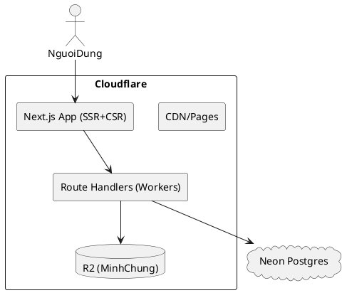

# SPEC-001 – CNKTYKLT Compliance Management Platform

## Background

Healthcare practitioners are required to continuously update their medical knowledge and demonstrate compliance over fixed cycles. In practice, management of these activities is largely manual (spreadsheets and paperwork), creating fragmentation, errors, and a heavy administrative burden. Oversight at the Department of Health level lacks real‑time visibility.

To address this, we will design a centralized, web-based system used sector‑wide by two management levels (Department of Health and Units). The platform will standardize activity types per the relevant regulation, support evidence file uploads, auto-calculate convertible credits, surface alerts for practitioners approaching the end of their 5‑year cycle with insufficient credits, and provide dashboards and exportable reports for both levels of management.

## Requirements

### MoSCoW Prioritization

**Must Have (M):**

- Practitioner registry with unique license ID, unit affiliation, role, status, and cycle dates.
- Configurable credit rules engine (default seed: 120 credits over 5-year cycle; min hours and category caps editable per regulation version).
- Standardized activity catalog (types, categories, credit conversion rules, evidence requirements, max/period caps).
- Activity submission by practitioners with evidence upload; unit reviewer workflow; DoH oversight.
- Automatic credit calculation and cycle tracking per practitioner; live progress %.
- Alerts/notifications for at-risk practitioners (e.g., <70%, <90%) and approaching deadlines (e.g., 6/3/1 months).
- Role-based access control (DoH Admin, Unit Admin, Practitioner, Auditor/Read-only).
- Dashboards: DoH (global), Unit (unit-level), Practitioner (self); export to CSV/PDF.
- **Data visualization for decision-making**: rich, diverse charts (bar/line/area/stacked, pie/donut, heatmap, treemap, funnel, boxplot) with cross-unit comparisons; interactive tooltips/legends; export to PNG/SVG/CSV; consistent theming.
- Bulk import for practitioners and historical credits (CSV template); idempotent upserts.
- Audit logging for every create/update/review action; immutable evidence checksum.
- Government-approved cloud deployment using Next.js app, Neon (PostgreSQL) as primary DB, Cloudflare Workers/Pages for APIs, and storage per constraints.

**Should Have (S):**

- SSO via OIDC/SAML with MFA; email/OTP fallback.
- Configurable notification channels (email, SMS gateway, webhook) with quiet hours.
- Multi-language UI strings; right-to-left support ready.
- Certificate generation with QR verification links; printable compliance letters.
- API for external CME providers to push verified activities (scoped tokens).

**Could Have (C):**

- OCR/auto-extract of certificate data to prefill entries.
- De-duplication heuristic across similar uploads.
- Mobile-friendly PWA with offline draft capture.

**Won’t Have (W) (MVP):**

- Multi-Department (cross‑DoH) tenancy.
- Public directory of practitioners.
- Payment processing/marketplace.

### Non-Functional Requirements

- **Scale & Size (assumed baseline):** up to 10k practitioners, 500 units, 1M activity records; peak 200 concurrent users.
- **Performance:** p95 page load < 2.0s on broadband; p95 API latency < 300ms for reads, < 700ms for writes.
- **Availability:** ≥ 99.5% monthly; graceful degradation under provider outages.
- **Security & Privacy:** TLS 1.3 in transit; AES-256 at rest; per-tenant data isolation (single DoH, multi-unit). Field-level encryption for sensitive IDs; evidence virus scanning before acceptance.
- **Data Residency & Retention:** data stored in approved regions; configurable retention (default 7 years) and legal hold.
- **Audit/Observability:** structured logs, request tracing, admin audit trails; SIEM export.
- **Backup/DR:** Neon PITR with daily branch snapshots; storage versioning; RPO ≤ 24h, RTO ≤ 8h.
- **Cost Guardrails:** prefer free/low-cost tiers initially; autoscaling with budgets/alerts.

> Assumptions above will be refined after confirming identity and storage details.

## Method

### 1) Kiến trúc tổng thể (MVP)

- **Frontend & SSR**: Next.js (App Router), chạy trên **Cloudflare Pages + Functions (Workers runtime)**; CDN và caching do Cloudflare đảm nhiệm. **UI**: `shadcn/ui` kết hợp bộ hiệu ứng **ReUI** (Tailwind + Motion) cho thành phần động.
- **API**: Route Handlers (`app/**/route.ts`) chạy ở **Workers**. Các API chính: xác thực, quản lý nhân sự, danh mục, nhập hoạt động, báo cáo, ký‑tự số liệu.
- **Xác thực**: **NextAuth (Auth.js) – Credentials provider** với **JWT session**; mật khẩu băm bằng **bcryptjs** (cost=10). Token chứa `sub`, `quyenHan`, `maDonVi`. Middleware bảo vệ route theo vai trò. (Workers không dùng native bcrypt, dùng **bcryptjs** thuần JS.)
- **CSDL chính**: **Neon Postgres** (serverless; kết nối qua driver HTTP). Tên cột **tiếng Việt (không dấu)** như trong yêu cầu.
- **Lưu trữ minh chứng**: **Cloudflare R2** (S3‑compatible). Luồng upload qua **API route** (stream tới R2) và trả về `url`, `etag`, `sha256`. **Giới hạn & loại tệp**: **PDF/JPG/PNG ≤ 10 MB/tệp**; chặn ở client + server.
- **Quy tắc tín chỉ**: Rule engine cấu hình được (chu kỳ 5 năm, tổng 120 tín chỉ, trần theo nhóm hoạt động, v.v.).
- **Giám sát & nhật ký**: Log có cấu trúc (JSON) ở API layer; bảng **NhatKyHeThong** ghi audit nghiệp vụ.
- **Data fetching phía client**: **TanStack Query v5** (SSR hydration, background refetch, staleTime theo màn hình).

#### PlantUML – Sơ đồ thành phần



---

### 2) Mô hình dữ liệu (Postgres/Neon)

> Quy ước: tên bảng/cột **không dấu, PascalCase** theo file yêu cầu. RLS **tắt** (thực thi phân quyền ở tầng ứng dụng + điều kiện `WHERE`).

#### Bảng **DonVi**

- `MaDonVi UUID PK`
- `TenDonVi TEXT NOT NULL`
- `CapQuanLy TEXT CHECK (CapQuanLy in ('SoYTe','BenhVien','TrungTam','PhongKham'))`
- `MaDonViCha UUID NULL` (FK tự tham chiếu)
- `TrangThai BOOLEAN DEFAULT true`
- Chỉ mục: `(TenDonVi)`, `(CapQuanLy)`

#### Bảng **NhanVien** (tham chiếu Mẫu 01)

- `MaNhanVien UUID PK`
- `HoVaTen TEXT NOT NULL`
- `SoCCHN TEXT UNIQUE`
- `NgayCapCCHN DATE`
- `MaDonVi UUID NOT NULL REFERENCES DonVi(MaDonVi)`
- `TrangThaiLamViec TEXT CHECK (TrangThaiLamViec in ('DangLamViec','DaNghi','TamHoan')) DEFAULT 'DangLamViec'`
- `Email TEXT`, `DienThoai TEXT`, `ChucDanh TEXT`
- Chỉ mục: `(MaDonVi)`, `(TrangThaiLamViec)`

#### Bảng **DanhMucHoatDong** (catalog hoạt động CNKTYKLT)

- `MaDanhMuc UUID PK`
- `TenDanhMuc TEXT NOT NULL`
- `LoaiHoatDong TEXT NOT NULL` (vd: 'KhoaHoc','HoiThao','NghienCuu','BaoCao')
- `DonViTinh TEXT CHECK (DonViTinh in ('gio','tiet','tin_chi')) DEFAULT 'gio'`
- `TyLeQuyDoi NUMERIC(6,2) NOT NULL DEFAULT 1.0`  -- số giờ -> tín chỉ
- `GioToiThieu NUMERIC(6,2)`, `GioToiDa NUMERIC(6,2)`
- `YeuCauMinhChung BOOLEAN DEFAULT true`
- `HieuLucTu DATE`, `HieuLucDen DATE`

#### Bảng **GhiNhanHoatDong** (tham chiếu Mẫu 04)

- `MaGhiNhan UUID PK`
- `MaNhanVien UUID NOT NULL REFERENCES NhanVien(MaNhanVien)`
- `MaDanhMuc UUID NULL REFERENCES DanhMucHoatDong(MaDanhMuc)`
- `TenHoatDong TEXT NOT NULL`
- `VaiTro TEXT` (vd: 'HocVien','BaoCaoVien')
- `ThoiGianBatDau TIMESTAMPTZ`, `ThoiGianKetThuc TIMESTAMPTZ`
- `SoGio NUMERIC(6,2)`, `SoTinChiQuyDoi NUMERIC(6,2) NOT NULL`
- `FileMinhChungUrl TEXT`, `FileMinhChungETag TEXT`, `FileMinhChungSha256 TEXT`, `FileMinhChungSize BIGINT`
- `NguoiNhap UUID NOT NULL`
- `TrangThaiDuyet TEXT CHECK (TrangThaiDuyet in ('ChoDuyet','DaDuyet','TuChoi')) DEFAULT 'ChoDuyet'`
- `ThoiGianDuyet TIMESTAMPTZ`, `GhiChu TEXT`
- `CreatedAt TIMESTAMPTZ DEFAULT now()`, `UpdatedAt TIMESTAMPTZ DEFAULT now()`
- Chỉ mục: `(MaNhanVien)`, `(TrangThaiDuyet)`, `(ThoiGianBatDau)`

#### Bảng **QuyTacTinChi** (rule engine/phiên bản quy định)

- `MaQuyTac UUID PK`
- `TenQuyTac TEXT NOT NULL`
- `TongTinChiYeuCau NUMERIC(6,2) DEFAULT 120`
- `ThoiHanNam INT DEFAULT 5`
- `TranTheoLoai JSONB`  -- vd: { "KhoaHoc": 80, "HoiThao": 40 }
- `HieuLucTu DATE`, `HieuLucDen DATE`
- `TrangThai BOOLEAN DEFAULT true`

#### Bảng **TaiKhoan** (tham chiếu Mẫu 05)

- `MaTaiKhoan UUID PK`
- `TenDangNhap TEXT UNIQUE NOT NULL`
- `MatKhauBam TEXT NOT NULL`  -- bcryptjs hash
- `QuyenHan TEXT CHECK (QuyenHan in ('SoYTe','DonVi','NguoiHanhNghe','Auditor')) NOT NULL`
- `MaDonVi UUID NULL REFERENCES DonVi(MaDonVi)`
- `TrangThai BOOLEAN DEFAULT true`, `TaoLuc TIMESTAMPTZ DEFAULT now()`

#### Bảng **NhatKyHeThong** (audit)

- `MaNhatKy UUID PK`, `MaTaiKhoan UUID`, `HanhDong TEXT`, `Bang TEXT`, `KhoaChinh TEXT`, `NoiDung JSONB`, `ThoiGian TIMESTAMPTZ DEFAULT now()`, `DiaChiIP TEXT`

> Gợi ý index bổ sung: `GhiNhanHoatDong(MaNhanVien, ThoiGianBatDau)`, `GhiNhanHoatDong(TrangThaiDuyet, MaDonVi)`, `DanhMucHoatDong(HieuLucTu, HieuLucDen)`.

---

### 3) Thuật toán & nghiệp vụ chính

**3.1. Tính tín chỉ quy đổi**

```
Input: ghiNhan, danhMuc, quyTac
if ghiNhan.SoTinChiQuyDoi đã nhập thủ công => dùng giá trị đó
else if danhMuc.DonViTinh = 'gio' => SoTinChiQuyDoi = ghiNhan.SoGio * danhMuc.TyLeQuyDoi
Giới hạn theo TranTheoLoai (nếu có) ở cấp chu kỳ.
```

**3.2. Xác định chu kỳ 5 năm của từng nhân viên**

```
start = NgayCapCCHN (hoặc NgayBatDau do quản trị set)
end   = start + interval '5 years'
progress = sum(SoTinChiQuyDoi trong [start, end]) / TongTinChiYeuCau
```

**3.3. Cảnh báo**

- Ngưỡng mặc định: <70% (vàng), <90% (đỏ) khi còn 6/3/1 tháng trước `end`.
- Batch job hàng ngày (Cron Trigger): tạo cảnh báo **in-app**; dashboard hiển thị danh sách.

**3.4. Phân quyền truy cập (app‑level, RLS tắt)**

- **SoYTe**: đọc/ghi toàn bộ; **DonVi**: `WHERE MaDonVi = :jwt.maDonVi`; **NguoiHanhNghe**: chỉ `WHERE MaNhanVien = :jwt.sub`.
- Mọi `SELECT/UPDATE/DELETE` ở API đều kèm điều kiện trên trước khi thực thi.

---

### 4) Luồng xác thực & ủy quyền (NextAuth)

- **Đăng nhập**: Credentials Provider; tìm `TaiKhoan.TenDangNhap`, so sánh `bcryptjs.compare(mkNhap, MatKhauBam)`.
- **JWT**: payload `sub`, `quyenHan`, `maDonVi`; TTL 8h, refresh bằng login lại (MVP). Cookie `secure`, `httpOnly`.
- **Middleware**: chặn các route `/don-vi/**` yêu cầu `quyenHan in ('DonVi','SoYTe')`; `/so-y-te/**` yêu cầu `SoYTe`.

#### PlantUML – Trình tự đăng nhập

```plantuml
@startuml
actor User
User -> Next: POST /auth/callback/credentials
Next -> API: find TaiKhoan by TenDangNhap
API -> PG: SELECT ... FROM TaiKhoan
PG --> API: MatKhauBam, QuyenHan, MaDonVi
API 
```
