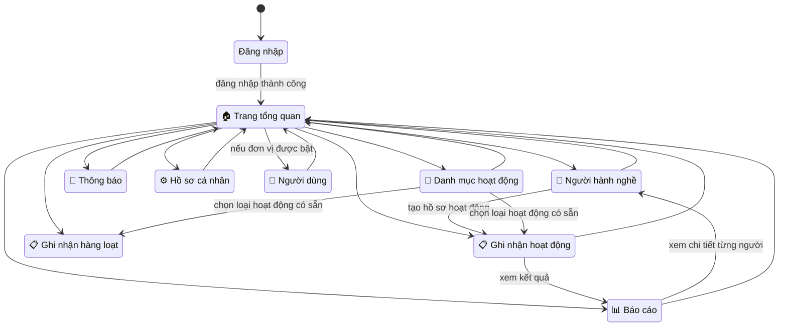
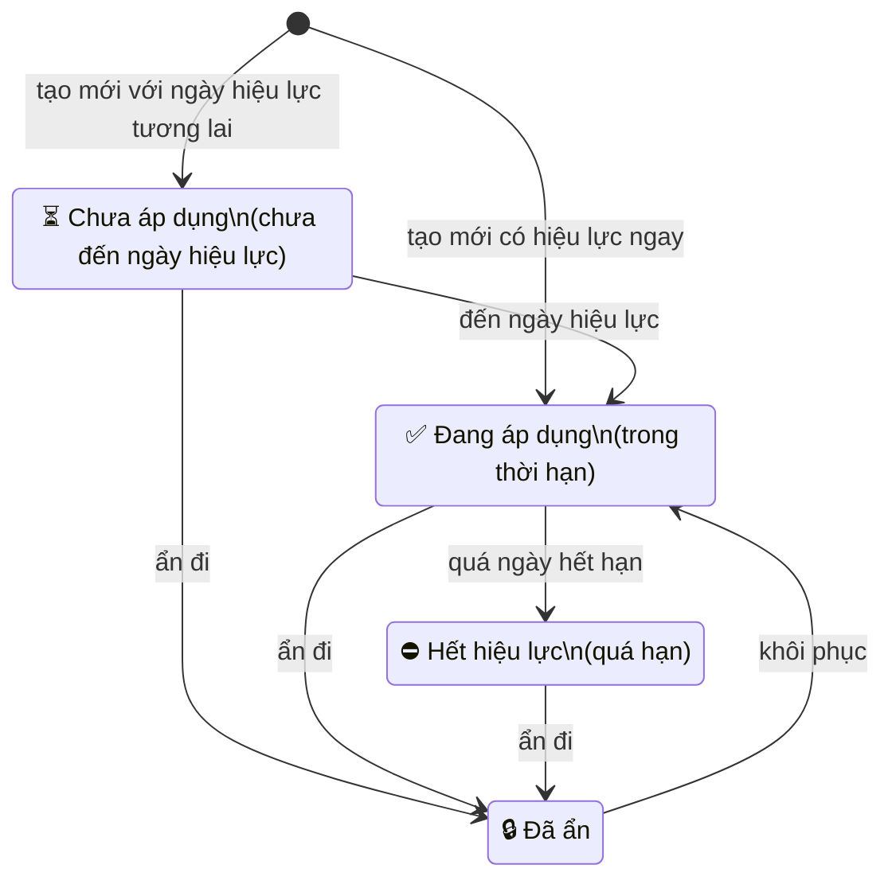
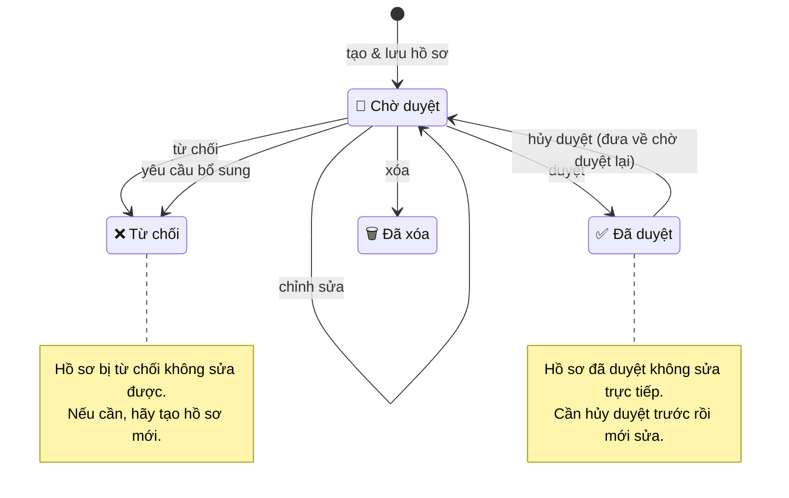

# Hướng Dẫn Sử Dụng Hệ Thống — Dành Cho Quản Lý Đơn Vị

## Tài liệu này dành cho ai?

Xin chào! Nếu bạn là người phụ trách quản lý nhân sự và theo dõi hoạt động chuyên môn tại đơn vị y tế, thì tài liệu này là dành cho bạn.

Sau khi đọc xong, bạn sẽ biết:

- mình được làm những gì trong hệ thống;
- nên vào đâu để xử lý từng công việc;
- quy trình ghi nhận, duyệt và theo dõi hoạt động diễn ra như thế nào;
- những điều cần lưu ý để tránh nhầm lẫn khi thao tác.

> **Lưu ý quan trọng:** Bạn chỉ làm việc với dữ liệu của chính đơn vị mình. Hệ thống không cho phép xem hay chỉnh sửa dữ liệu của đơn vị khác.

---

## Sau khi đăng nhập, bạn sẽ thấy gì?

Hệ thống sẽ đưa bạn về **Trang tổng quan** — nơi bạn nên ghé qua đầu tiên mỗi ngày.

Thanh menu bên trái có các mục chính sau:

| Mục | Mô tả ngắn |
|-----|------------|
| 🏠 **Trang tổng quan** | Nhìn nhanh toàn cảnh đơn vị |
| 👥 **Người hành nghề** | Quản lý danh sách nhân sự |
| 📋 **Quản lý hoạt động** | Ghi nhận, duyệt hồ sơ hoạt động |
| ↳ Ghi nhận hoạt động | Tạo & xử lý hồ sơ từng người |
| ↳ Ghi nhận hàng loạt | Tạo hồ sơ cho nhiều người cùng lúc |
| ↳ Danh mục hoạt động | Quản lý các loại hoạt động |
| 📊 **Báo cáo** | Xem thống kê, mức độ đạt yêu cầu |
| 👤 **Người dùng** | Quản lý tài khoản *(chỉ hiện nếu đơn vị được bật)* |
| 🔔 **Thông báo** | Xem nhắc việc và tin nhắn hệ thống |
| ⚙️ **Hồ sơ cá nhân** | Cập nhật thông tin, đổi mật khẩu |

Trên giao diện, bạn cũng sẽ thấy **số thông báo chưa đọc** và **số hồ sơ đang chờ xử lý** ngay trên menu để tiện theo dõi.

---

## Bạn có thể làm gì? Và không thể làm gì?

### ✅ Bạn có thể

- Xem, thêm mới, cập nhật thông tin người hành nghề của đơn vị
- Nhập nhiều người cùng lúc bằng tệp Excel
- Tạo hồ sơ hoạt động cho từng người hoặc cho cả nhóm
- Duyệt, từ chối, yêu cầu bổ sung, hủy duyệt hồ sơ
- Duyệt hoặc hủy duyệt hàng loạt nhiều hồ sơ cùng lúc
- Xóa hàng loạt các hồ sơ đang chờ duyệt
- Tạo danh mục hoạt động riêng cho đơn vị
- Xem báo cáo tổng hợp của đơn vị
- Quản lý tài khoản người hành nghề *(nếu đơn vị được bật tính năng này)*
- Đính kèm tệp minh chứng khi ghi nhận hoạt động
- Cập nhật hồ sơ cá nhân và đổi mật khẩu

### 🚫 Bạn không thể

- Xem dữ liệu của đơn vị khác
- Sửa các loại hoạt động chung do hệ thống quản lý
- Chuyển người hành nghề hoặc tài khoản sang đơn vị khác
- Sửa hồ sơ đã duyệt hoặc đã bị từ chối *(chỉ sửa được khi còn đang chờ duyệt)*
- Tạo tài khoản cho các vai trò quản trị khác

---

## Sơ đồ tổng quan: Bạn đi đâu, làm gì?



Hiểu đơn giản:

- Bạn bắt đầu từ **Trang tổng quan** để nắm tình hình chung.
- Cần quản lý nhân sự → vào **Người hành nghề**.
- Cần ghi nhận hoạt động → vào **Ghi nhận hoạt động** hoặc **Ghi nhận hàng loạt**.
- Cần tạo sẵn loại hoạt động hay dùng → vào **Danh mục hoạt động**.
- Cần xem bức tranh toàn cảnh → vào **Báo cáo**.

---

## 🏠 Trang tổng quan

Đây là nơi bạn nên mở đầu tiên mỗi ngày — giống như bảng tin trên bàn làm việc.

Tại đây bạn thấy ngay:

- **Tổng số người hành nghề** đang quản lý
- **Số người đang làm việc** (phân biệt với người đã nghỉ)
- **Hồ sơ đang chờ duyệt** — con số này giúp bạn biết có bao nhiêu việc cần xử lý
- **Số hồ sơ đã duyệt / từ chối trong tháng** — để nắm tiến độ
- **Tỷ lệ đạt yêu cầu** của đơn vị
- **Số người có nguy cơ** chưa đủ tín chỉ

> 💡 **Mẹo:** Nếu thấy số "chờ duyệt" tăng lên, hãy bấm vào đó để xử lý ngay.

---

## 👥 Quản lý người hành nghề

Đây là nơi bạn quản lý danh sách nhân sự thuộc đơn vị mình.

### Xem và tìm kiếm

- Xem toàn bộ danh sách người hành nghề
- Tìm theo họ tên, mã số, hoặc số chứng chỉ hành nghề
- Lọc theo trạng thái làm việc (đang làm việc, đã nghỉ…)

### Thêm mới từng người

Phù hợp khi chỉ có một vài hồ sơ cần nhập, hoặc cần kiểm tra kỹ trước khi lưu.

Bạn sẽ nhập các thông tin như: họ tên, số chứng chỉ hành nghề, ngày sinh, liên hệ, chuyên môn, trạng thái làm việc.

> Người được tạo mới sẽ **tự động thuộc đơn vị của bạn**. Bạn không cần chọn đơn vị.

### Nhập danh sách từ Excel

Phù hợp khi cần nhập nhiều người cùng lúc — ví dụ khi mới bắt đầu sử dụng hệ thống, hoặc tiếp nhận một đợt nhân sự mới.

Quy trình:

1. **Tải tệp mẫu** từ hệ thống
2. **Điền thông tin** theo đúng các cột trong mẫu
3. **Tải tệp lên** để hệ thống kiểm tra
4. **Xem kết quả kiểm tra** — hệ thống sẽ báo lỗi hoặc cảnh báo nếu có
5. **Xác nhận nhập** khi đã hài lòng với dữ liệu

Lưu ý:

- Nếu số chứng chỉ trùng với người **đã có trong đơn vị**, hệ thống sẽ cảnh báo để bạn kiểm tra lại
- Nếu trùng với người đang thuộc **đơn vị khác**, hệ thống sẽ không cho nhập
- Nên **rà soát kỹ dữ liệu** trong Excel trước khi tải lên để giảm lỗi

### Chỉnh sửa và ngừng theo dõi

- Bạn có thể **cập nhật thông tin** bất cứ lúc nào
- Khi một người không còn làm việc tại đơn vị, thao tác "xóa" thực chất là **đánh dấu đã nghỉ** — hệ thống vẫn giữ lại lịch sử để tra cứu sau này

---

## 📂 Danh mục hoạt động

Danh mục hoạt động giống như một "kho mẫu" — bạn tạo sẵn các loại hoạt động hay dùng để mỗi lần ghi nhận không phải nhập lại từ đầu.

### Hai nhóm hoạt động

| Nhóm | Ai quản lý | Bạn có sửa được không? |
|------|-----------|----------------------|
| Hoạt động dùng chung | Hệ thống (Sở Y tế) | ❌ Không |
| Hoạt động của đơn vị | Chính bạn | ✅ Có |

### Bạn có thể

- Xem tất cả hoạt động (cả chung lẫn riêng)
- Tạo hoạt động mới riêng cho đơn vị
- Sửa hoặc ẩn hoạt động do đơn vị mình tạo
- Khôi phục hoạt động đã ẩn khi cần dùng lại

### Khi nào nên tạo hoạt động mới?

- Khi đơn vị có loại hoạt động lặp đi lặp lại (ví dụ: hội thảo nội bộ hàng quý)
- Khi muốn thống nhất tên gọi, số tiết cho mọi người
- Khi cần dùng cho ghi nhận hàng loạt

### Vòng đời của một hoạt động



> 💡 **Mẹo:** Tạo sẵn hoạt động trong danh mục giúp bạn thao tác nhanh hơn và báo cáo thống nhất hơn.

---

## 📋 Ghi nhận hoạt động

Đây là **khu vực quan trọng nhất** — nơi bạn tạo hồ sơ hoạt động và xử lý các hồ sơ đang chờ.

### Ghi nhận cho từng người

Các bước:

1. Chọn **người hành nghề** thuộc đơn vị
2. Chọn **loại hoạt động** từ danh mục có sẵn, hoặc tự nhập thông tin
3. Nhập **thời gian**, **số tiết/tín chỉ**, ghi chú nếu cần
4. Đính kèm **tệp minh chứng** (giấy chứng nhận, hình ảnh…) nếu có
5. Bấm **Lưu**

> Nếu chọn hoạt động có sẵn trong danh mục, hệ thống sẽ tự điền sẵn một phần thông tin.

### Ghi nhận hàng loạt

Khi **nhiều người cùng tham gia một hoạt động** (ví dụ: cả nhóm học cùng một lớp, cùng dự một buổi tập huấn), bạn nên dùng tính năng này thay vì tạo từng hồ sơ.

Các bước:

1. Chọn **loại hoạt động**
2. Chọn **nhóm người** cần áp dụng (có thể lọc theo trạng thái, chuyên môn, phòng ban)
3. Xem trước **danh sách** trước khi xác nhận
4. Bấm **Xác nhận** để tạo hồ sơ cho cả nhóm

> ⚠️ **Quan trọng:** Hãy kiểm tra kỹ danh sách trước khi xác nhận để tránh tạo nhầm cho người không liên quan.

---

## Xử lý hồ sơ hoạt động

Sau khi tạo, mỗi hồ sơ sẽ đi qua các trạng thái khác nhau. Dưới đây là toàn bộ luồng xử lý:

### Sơ đồ trạng thái hồ sơ



### Giải thích từng thao tác

| Thao tác | Khi nào nên dùng? | Hồ sơ sẽ chuyển sang |
|----------|-------------------|---------------------|
| **Duyệt** | Hồ sơ đầy đủ, hợp lệ, minh chứng rõ ràng | ✅ Đã duyệt |
| **Từ chối** | Hồ sơ sai nội dung, minh chứng không phù hợp, không đủ điều kiện | ❌ Từ chối |
| **Yêu cầu bổ sung** | Hồ sơ còn thiếu thông tin hoặc giấy tờ, cần người nộp bổ sung | ❌ Từ chối *(kèm ghi chú cần bổ sung gì)* |
| **Chỉnh sửa** | Cần sửa nhỏ trước khi duyệt (chỉ sửa được khi còn chờ duyệt) | 📝 Vẫn ở Chờ duyệt |
| **Xóa** | Hồ sơ tạo nhầm, không cần nữa (chỉ xóa được khi còn chờ duyệt) | 🗑️ Đã xóa |
| **Hủy duyệt** | Phát hiện hồ sơ đã duyệt nhưng có sai sót, cần xem lại | 📝 Quay về Chờ duyệt |

### Lưu ý quan trọng

- **Chỉ sửa/xóa được** khi hồ sơ còn ở trạng thái **Chờ duyệt**
- Hồ sơ **đã duyệt** muốn sửa → phải **hủy duyệt** trước, rồi mới chỉnh sửa
- Hồ sơ **bị từ chối** không sửa lại được → hãy **tạo hồ sơ mới** sau khi đã bổ sung thông tin
- Khi **yêu cầu bổ sung**, hãy ghi rõ ràng cần bổ sung điều gì — người nhận sẽ thấy ghi chú này

---

## Xử lý hàng loạt

Khi có nhiều hồ sơ cần xử lý cùng lúc, bạn không cần duyệt từng cái một.

### Duyệt hàng loạt

Chọn nhiều hồ sơ đang **Chờ duyệt** → bấm **Duyệt tất cả**. Hệ thống sẽ duyệt toàn bộ trong một thao tác.

### Hủy duyệt hàng loạt

Chọn nhiều hồ sơ **Đã duyệt** → bấm **Hủy duyệt**. Bạn cần nhập lý do hủy — lý do này sẽ được ghi lại kèm theo hồ sơ.

### Xóa hàng loạt

Chọn nhiều hồ sơ đang **Chờ duyệt** → bấm **Xóa**. Chỉ những hồ sơ còn ở trạng thái chờ mới xóa được.

> 💡 Xử lý hàng loạt giúp tiết kiệm thời gian đáng kể khi đơn vị có nhiều hồ sơ cần giải quyết cùng lúc.

---

## 📊 Báo cáo

Mục **Báo cáo** giúp bạn nhìn toàn cảnh tình hình đơn vị — ai đang đạt, ai chưa đạt, đơn vị đang ở đâu so với yêu cầu.

### Các loại báo cáo

| Báo cáo | Nội dung |
|---------|---------|
| **Tổng quan hoạt động** | Thống kê số lượng hồ sơ theo trạng thái, loại hoạt động, khoảng thời gian |
| **Mức độ đạt yêu cầu** | Xem từng người đã tích lũy bao nhiêu tín chỉ so với yêu cầu, ai đạt / chưa đạt / có nguy cơ |
| **Hiệu suất đơn vị** | Các chỉ số tổng hợp về hiệu suất hoạt động của đơn vị |
| **Chi tiết từng người** | Xem chi tiết hoạt động, tín chỉ của một người cụ thể |

### Cách dùng thực tế

1. Mở báo cáo **Mức độ đạt yêu cầu** để xem ai chưa đạt
2. Bấm vào tên người đó để xem chi tiết
3. Nếu thiếu hoạt động, quay sang **Ghi nhận hoạt động** để bổ sung
4. Quay lại báo cáo để kiểm tra kết quả cập nhật

> Toàn bộ số liệu trong báo cáo **chỉ thuộc đơn vị của bạn**.

---

## 👤 Quản lý tài khoản người hành nghề

> ⚠️ Mục này **chỉ xuất hiện** khi đơn vị được bật tính năng quản lý tài khoản. Nếu bạn không thấy mục "Người dùng" trong menu, nghĩa là tính năng này chưa được kích hoạt cho đơn vị bạn.

### Bạn có thể

- Xem danh sách tài khoản người hành nghề trong đơn vị
- Tạo tài khoản mới cho người thuộc đơn vị mình
- Cập nhật thông tin tài khoản
- Ngừng kích hoạt tài khoản không còn sử dụng

### Bạn không thể

- Tạo tài khoản cho vai trò quản trị khác (Sở Y tế, Kiểm toán…)
- Quản lý tài khoản của đơn vị khác
- Chuyển tài khoản sang đơn vị khác

> Khi "xóa" tài khoản, hệ thống sẽ **ngừng cho đăng nhập** chứ không xóa mất dữ liệu. Lịch sử hoạt động vẫn được giữ lại.

---

## 🔔 Thông báo

Mục **Thông báo** giúp bạn không bỏ sót việc cần xử lý.

Bạn có thể:

- Xem danh sách thông báo mới
- Lọc chỉ xem thông báo chưa đọc
- Đánh dấu đã đọc từng thông báo hoặc tất cả cùng lúc

Hệ thống sẽ gửi thông báo cho bạn khi:

- Có hồ sơ hoạt động mới cần xử lý
- Có tài khoản mới được tạo
- Có cảnh báo về mức độ đạt yêu cầu

> 💡 Nên kiểm tra thông báo thường xuyên, nhất là vào đầu ngày hoặc khi đơn vị đang trong giai đoạn rà soát hồ sơ.

---

## ⚙️ Hồ sơ cá nhân

Đây là nơi bạn quản lý tài khoản của chính mình.

- **Xem** thông tin cá nhân (tên đăng nhập, vai trò, đơn vị)
- **Cập nhật** thông tin hiển thị
- **Đổi mật khẩu** khi cần

> Nên đổi mật khẩu định kỳ và không dùng chung tài khoản với người khác.

---

## Gợi ý quy trình làm việc mỗi ngày

Nếu bạn muốn làm việc hiệu quả và không bỏ sót gì, hãy thử theo nhịp sau:

```
1. 🏠 Mở Trang tổng quan → xem hôm nay có gì mới
        ↓
2. 🔔 Kiểm tra Thông báo → có nhắc việc gì cần xử lý?
        ↓
3. 📋 Vào Ghi nhận hoạt động → xem hồ sơ đang chờ duyệt
        ↓
4. ✅ Xử lý hồ sơ → duyệt / từ chối / yêu cầu bổ sung
        ↓
5. 👥 Nếu thiếu người → vào Người hành nghề để thêm mới
        ↓
6. 📂 Nếu thiếu loại hoạt động → vào Danh mục để tạo sẵn
        ↓
7. 📋 Tạo hồ sơ mới (đơn lẻ hoặc hàng loạt)
        ↓
8. 📊 Cuối ngày, mở Báo cáo → xem bức tranh toàn cảnh
```

---

## Những lưu ý quan trọng

1. **Không tìm thấy người?** Kiểm tra xem người đó có thật sự thuộc đơn vị mình không. Bạn chỉ thấy dữ liệu của đơn vị mình.

2. **"Xóa" không có nghĩa là mất.** Xóa người hành nghề = đánh dấu đã nghỉ. Xóa tài khoản = ngừng cho đăng nhập. Lịch sử vẫn còn.

3. **Hồ sơ "Chờ duyệt" là linh hoạt nhất.** Bạn có thể sửa, xóa, duyệt, từ chối — mọi thao tác đều mở. Sau khi duyệt hoặc từ chối, các lựa chọn sẽ bị hạn chế.

4. **Hủy duyệt cần lý do.** Khi hủy duyệt hồ sơ đã duyệt, bạn bắt buộc phải nhập lý do. Lý do này được ghi lại để theo dõi.

5. **Yêu cầu bổ sung = từ chối kèm hướng dẫn.** Hệ thống sẽ đánh dấu hồ sơ là từ chối nhưng kèm theo ghi chú cụ thể bạn muốn người nộp bổ sung gì. Hãy ghi rõ ràng, dễ hiểu.

6. **Ghi nhận hàng loạt cần cẩn thận.** Xem kỹ danh sách trước khi xác nhận — một khi đã tạo, bạn sẽ phải xóa từng hồ sơ hoặc dùng xóa hàng loạt nếu tạo nhầm.

---

## Mẹo sử dụng hiệu quả

- 📂 **Tạo sẵn danh mục hoạt động** cho những loại hay dùng — tiết kiệm thời gian và giúp báo cáo nhất quán
- 📊 **Xem báo cáo định kỳ**, đừng đợi cuối kỳ mới kiểm tra — phát hiện sớm sẽ xử lý kịp
- 📝 **Ghi chú rõ ràng** khi từ chối hoặc yêu cầu bổ sung — người nhận cần biết chính xác phải làm gì
- 📋 **Dùng ghi nhận hàng loạt** khi nhiều người học cùng lớp — nhanh hơn nhiều so với tạo từng cái
- 🧹 **Làm sạch dữ liệu Excel** trước khi nhập — ít lỗi hơn, ít phải sửa lại
- ✅ **Xử lý hồ sơ chờ duyệt sớm** — tránh để tồn đọng quá nhiều
